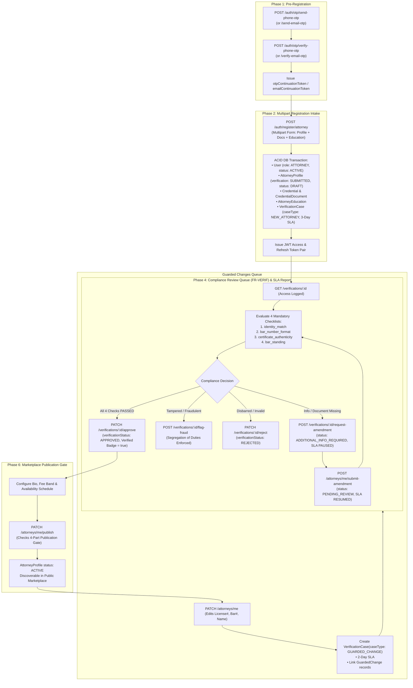

# Attorney Registration to Verification Workflow (Complete Payload & API Reference)

This document provides the technical specification, state machine logic, data models, and complete **Request & Response payloads** for every endpoint involved in the Attorney Onboarding, Verification, SLA Reporting, and Marketplace Publication lifecycle in the **Tebeka Legal Portal**.

---

## Table of Contents
1. [Domain Enums & Data Model Architecture](#1-domain-enums--data-model-architecture)
2. [Lifecycle Overview & State Machine Diagram](#2-lifecycle-overview--state-machine-diagram)
3. [Phase 1: Pre-Registration Identity Proofing (OTP)](#phase-1-pre-registration-identity-proofing-otp)
   - [1.1 Send Phone SMS OTP](#11-send-phone-sms-otp)
   - [1.2 Verify Phone SMS OTP](#12-verify-phone-sms-otp)
   - [1.3 Send Email OTP](#13-send-email-otp)
   - [1.4 Verify Email OTP](#14-verify-email-otp)
4. [Phase 2: Attorney Registration & Multipart Document Intake](#phase-2-attorney-registration--multipart-document-intake)
   - [2.1 Attorney Registration Request](#21-attorney-registration-request)
   - [2.2 Registration Error Handling](#22-registration-error-handling)
5. [Phase 3: Attorney Self-Service Portal & Case Tracker](#phase-3-attorney-self-service-portal--case-tracker)
   - [3.1 Fetch Authenticated Attorney Profile (`/attorneys/me`)](#31-fetch-authenticated-attorney-profile-attorneysme)
   - [3.2 Check Verification Progress (`/verifications/my-case`)](#32-check-verification-progress-verificationsmy-case)
   - [3.3 View Credential Vault (`/attorneys/me/credentials`)](#33-view-credential-vault-attorneysmecredentials)
6. [Phase 4: Admin Compliance Review Queue (FR-VERIF) & SLA Reporting](#phase-4-admin-compliance-review-queue-fr-verif--sla-reporting)
   - [4.1 List Verification Cases (Filtered by `caseType` & `status`)](#41-list-verification-cases-filtered-by-casetype--status)
   - [4.2 Get Verification Case Details](#42-get-verification-case-details)
   - [4.3 Update Checklist Item](#43-update-checklist-item)
   - [4.4 Record Bar Standing Verification Check](#44-record-bar-standing-verification-check)
   - [4.5 SLA Compliance & Breach Report (`/verifications/sla-report`)](#45-sla-compliance--breach-report-verificationssla-report)
7. [Phase 5: Review Decisions & Amendment Loops](#phase-5-review-decisions--amendment-loops)
   - [5.1 Request Amendment (Admin Action)](#51-request-amendment-admin-action)
   - [5.2 Submit Amendment Response (Attorney Action)](#52-submit-amendment-response-attorney-action)
   - [5.3 Flag Fraud Case (Segregation of Duties)](#53-flag-fraud-case-segregation-of-duties)
   - [5.4 Reject Verification Case](#54-reject-verification-case)
   - [5.5 Approve Verification Case](#55-approve-verification-case)
8. [Phase 6: Marketplace Publication Gate & Guarded Changes Queue](#phase-6-marketplace-publication-gate--guarded-changes-queue)
   - [6.1 Publish Profile to Marketplace](#61-publish-profile-to-marketplace)
   - [6.2 Hide / Deactivate Profile](#62-hide--deactivate-profile)
   - [6.3 Guarded Changes Lifecycle (`caseType: GUARDED_CHANGE`)](#63-guarded-changes-lifecycle-casetype-guarded_change)

---

## 1. Domain Enums & Data Model Architecture

The portal architecture cleanly separates case-level workflow state from attorney platform standing and categorizes verification jobs by `CaseType`:

```prisma
enum CaseType {
  NEW_ATTORNEY     // Initial attorney intake & registration (3-Day SLA)
  GUARDED_CHANGE   // Post-verification edits to sensitive fields (2-Day SLA)
  ANNUAL           // Yearly license & standing renewal verification
  FRAUD_REVIEW     // Senior compliance investigation for flagged anomalies
}

enum CaseStatus {
  SUBMITTED
  PENDING_REVIEW
  ADDITIONAL_INFO_REQUIRED
  APPROVED
  REJECTED
  CANCELLED
}

enum AttorneyVerificationStatus {
  DRAFT
  SUBMITTED
  PENDING_REVIEW
  ADDITIONAL_INFO_REQUIRED
  APPROVED
  REJECTED
  SUSPENDED
  EXPIRED
}
```

---

## 2. Lifecycle Overview & State Machine Diagram



---

## Phase 1: Pre-Registration Identity Proofing (OTP)

### 1.1 Send Phone SMS OTP
Dispatches a 6-digit numeric OTP via Ethio Telecom / SMS gateway.

* **Method**: `POST`
* **Path**: `/auth/otp/send-phone-otp`
* **Auth**: Public

#### Request
```http
POST /auth/otp/send-phone-otp HTTP/1.1
Host: api.tebeka.et
Content-Type: application/json

{
  "phone": "+251911234567",
  "purpose": "REGISTRATION"
}
```

#### Response: `200 OK`
```json
{
  "status": "success",
  "message": "OTP sent successfully to +251911234567",
  "expiresInSeconds": 300,
  "resendIntervalSeconds": 60
}
```

---

### 1.2 Verify Phone SMS OTP
Validates the 6-digit code and produces a secure continuation token.

* **Method**: `POST`
* **Path**: `/auth/otp/verify-phone-otp`
* **Auth**: Public

#### Request
```http
POST /auth/otp/verify-phone-otp HTTP/1.1
Host: api.tebeka.et
Content-Type: application/json

{
  "phone": "+251911234567",
  "code": "847291"
}
```

#### Response: `200 OK`
```json
{
  "status": "success",
  "message": "Phone number verified successfully",
  "phone": "+251911234567",
  "continuationToken": "ct_phone_9f83a2e1b4c67d8e90a1b2c3d4e5f6a7",
  "expiresInSeconds": 900
}
```

---

### 1.3 Send Email OTP
* **Method**: `POST`
* **Path**: `/auth/otp/send-email-otp`
* **Auth**: Public

```http
POST /auth/otp/send-email-otp HTTP/1.1
Host: api.tebeka.et
Content-Type: application/json

{
  "email": "dawit.solomon@tebekalaw.et"
}
```

#### Response: `200 OK`
```json
{
  "status": "success",
  "message": "OTP verification email dispatched to dawit.solomon@tebekalaw.et",
  "expiresInSeconds": 600
}
```

---

### 1.4 Verify Email OTP
* **Method**: `POST`
* **Path**: `/auth/otp/verify-email-otp`
* **Auth**: Public

```http
POST /auth/otp/verify-email-otp HTTP/1.1
Host: api.tebeka.et
Content-Type: application/json

{
  "email": "dawit.solomon@tebekalaw.et",
  "code": "512940"
}
```

#### Response: `200 OK`
```json
{
  "status": "success",
  "message": "Email address verified successfully",
  "email": "dawit.solomon@tebekalaw.et",
  "emailContinuationToken": "ct_email_7a1b2c3d4e5f608192a3b4c5d6e7f8a9",
  "expiresInSeconds": 900
}
```

---

## Phase 2: Attorney Registration & Multipart Document Intake

### 2.1 Attorney Registration Request
Atomically registers the attorney user, creates profile and credential vault entities, assigns academic history, and creates a verification case with `caseType: "NEW_ATTORNEY"` and a 3-day SLA timer.

* **Method**: `POST`
* **Path**: `/auth/register/attorney` (or `POST /auth/register` with `role: "ATTORNEY"`)
* **Content-Type**: `multipart/form-data`
* **Headers**: `x-otp-continuation-token: ct_phone_9f83a2e1b4c67d8e90a1b2c3d4e5f6a7`

#### Request (Multipart Form Data)
```http
POST /auth/register/attorney HTTP/1.1
Host: api.tebeka.et
x-otp-continuation-token: ct_phone_9f83a2e1b4c67d8e90a1b2c3d4e5f6a7
Content-Type: multipart/form-data; boundary=----WebKitFormBoundary7MA4YWxkTrZu0gW

------WebKitFormBoundary7MA4YWxkTrZu0gW
Content-Disposition: form-data; name="fullName"

Dr. Dawit Solomon
------WebKitFormBoundary7MA4YWxkTrZu0gW
Content-Disposition: form-data; name="email"

dawit.solomon@tebekalaw.et
------WebKitFormBoundary7MA4YWxkTrZu0gW
Content-Disposition: form-data; name="password"

P@ssw0rdSecure2026!
------WebKitFormBoundary7MA4YWxkTrZu0gW
Content-Disposition: form-data; name="phone"

+251911234567
------WebKitFormBoundary7MA4YWxkTrZu0gW
Content-Disposition: form-data; name="barRegistrationNumber"

ET-BAR-2015-8942
------WebKitFormBoundary7MA4YWxkTrZu0gW
Content-Disposition: form-data; name="licenseNumber"

FMoJ/ADV/8942/2015
------WebKitFormBoundary7MA4YWxkTrZu0gW
Content-Disposition: form-data; name="barAdmissionYear"

2015
------WebKitFormBoundary7MA4YWxkTrZu0gW
Content-Disposition: form-data; name="yearsOfExperience"

11
------WebKitFormBoundary7MA4YWxkTrZu0gW
Content-Disposition: form-data; name="gender"

MALE
------WebKitFormBoundary7MA4YWxkTrZu0gW
Content-Disposition: form-data; name="age"

38
------WebKitFormBoundary7MA4YWxkTrZu0gW
Content-Disposition: form-data; name="nationalIdNumber"

FAN-98421034-ET
------WebKitFormBoundary7MA4YWxkTrZu0gW
Content-Disposition: form-data; name="lawFirmName"

Dawit Solomon & Associates Law Office
------WebKitFormBoundary7MA4YWxkTrZu0gW
Content-Disposition: form-data; name="practiceAreas"

["Corporate Law", "Commercial Arbitration", "Taxation", "Intellectual Property"]
------WebKitFormBoundary7MA4YWxkTrZu0gW
Content-Disposition: form-data; name="languagesSpoken"

["en", "am"]
------WebKitFormBoundary7MA4YWxkTrZu0gW
Content-Disposition: form-data; name="officeAddress"

Bole Subcity, Woreda 03, Sunshine Building, 4th Floor, Office 402
------WebKitFormBoundary7MA4YWxkTrZu0gW
Content-Disposition: form-data; name="subcity"

Bole
------WebKitFormBoundary7MA4YWxkTrZu0gW
Content-Disposition: form-data; name="city"

Addis Ababa
------WebKitFormBoundary7MA4YWxkTrZu0gW
Content-Disposition: form-data; name="googleMapsPin"

https://maps.google.com/?q=9.0105,38.7892
------WebKitFormBoundary7MA4YWxkTrZu0gW
Content-Disposition: form-data; name="consultationFee"

2500
------WebKitFormBoundary7MA4YWxkTrZu0gW
Content-Disposition: form-data; name="feeBand"

STANDARD
------WebKitFormBoundary7MA4YWxkTrZu0gW
Content-Disposition: form-data; name="onlineConsultation"

true
------WebKitFormBoundary7MA4YWxkTrZu0gW
Content-Disposition: form-data; name="videoSupport"

true
------WebKitFormBoundary7MA4YWxkTrZu0gW
Content-Disposition: form-data; name="bio"

Senior corporate attorney with over a decade of experience advising domestic enterprises and multinational corporations on foreign investment, commercial litigation, mergers, and tax compliance in Ethiopia.
------WebKitFormBoundary7MA4YWxkTrZu0gW
Content-Disposition: form-data; name="institution"

Addis Ababa University - School of Law
------WebKitFormBoundary7MA4YWxkTrZu0gW
Content-Disposition: form-data; name="degree"

LL.M in Business & Commercial Law
------WebKitFormBoundary7MA4YWxkTrZu0gW
Content-Disposition: form-data; name="fieldOfStudy"

Commercial Law
------WebKitFormBoundary7MA4YWxkTrZu0gW
Content-Disposition: form-data; name="startYear"

2013
------WebKitFormBoundary7MA4YWxkTrZu0gW
Content-Disposition: form-data; name="graduationYear"

2015
------WebKitFormBoundary7MA4YWxkTrZu0gW
Content-Disposition: form-data; name="licenseBook"; filename="license_book_scan.pdf"
Content-Type: application/pdf

<BINARY PDF CONTENT>
------WebKitFormBoundary7MA4YWxkTrZu0gW
Content-Disposition: form-data; name="barRegistration"; filename="bar_certificate.pdf"
Content-Type: application/pdf

<BINARY PDF CONTENT>
------WebKitFormBoundary7MA4YWxkTrZu0gW
Content-Disposition: form-data; name="nationalIdDocument"; filename="fayda_national_id.pdf"
Content-Type: application/pdf

<BINARY PDF CONTENT>
------WebKitFormBoundary7MA4YWxkTrZu0gW
Content-Disposition: form-data; name="profilePhoto"; filename="dr_dawit_portrait.jpg"
Content-Type: image/jpeg

<BINARY IMAGE CONTENT>
------WebKitFormBoundary7MA4YWxkTrZu0gW
Content-Disposition: form-data; name="otherDocuments"; filename="llm_degree_certificate.pdf"
Content-Type: application/pdf

<BINARY PDF CONTENT>
------WebKitFormBoundary7MA4YWxkTrZu0gW--
```

#### Response: `201 Created`
```json
{
  "status": "success",
  "message": "Attorney registered successfully in PENDING_VERIFICATION (SUBMITTED) status and routed to FR-VERIF verification queue",
  "token": "eyJhbGciOiJIUzI1NiIsInR5cCI6IkpXVCJ9.ey...",
  "accessToken": "eyJhbGciOiJIUzI1NiIsInR5cCI6IkpXVCJ9.ey...",
  "refreshToken": "rf_a8b9c0d1e2f3a4b5c6d7e8f9a0b1c2d3e4f5a6b7",
  "expiresInSeconds": 2592000,
  "user": {
    "id": "c9284242-b054-44cf-a337-14fa8e9d3b4e",
    "name": "Dr. Dawit Solomon",
    "phone": "+251911234567",
    "email": "dawit.solomon@tebekalaw.et",
    "role": "ATTORNEY",
    "phoneVerified": true,
    "emailVerified": false,
    "attorneyProfileId": "e719c832-4467-4dae-bc91-314159265358",
    "verificationCaseId": "f128c940-1122-4433-8899-aabbccddeeff",
    "caseType": "NEW_ATTORNEY"
  }
}
```

---

## Phase 3: Attorney Self-Service Portal & Case Tracker

### 3.1 Fetch Authenticated Attorney Profile (`/attorneys/me`)
* **Method**: `GET`
* **Path**: `/attorneys/me`
* **Headers**: `Authorization: Bearer <accessToken>`

#### Response: `200 OK`
```json
{
  "id": "e719c832-4467-4dae-bc91-314159265358",
  "userId": "c9284242-b054-44cf-a337-14fa8e9d3b4e",
  "fullName": "Dr. Dawit Solomon",
  "licenseNumber": "FMoJ/ADV/8942/2015",
  "barRegistrationNumber": "ET-BAR-2015-8942",
  "barAdmissionYear": 2015,
  "yearsOfExperience": 11,
  "age": 38,
  "gender": "MALE",
  "practiceAreas": ["Corporate Law", "Commercial Arbitration", "Taxation", "Intellectual Property"],
  "languagesSpoken": ["en", "am"],
  "officeAddress": "Bole Subcity, Woreda 03, Sunshine Building, 4th Floor, Office 402",
  "subcity": "Bole",
  "city": "Addis Ababa",
  "consultationFee": 2500.0,
  "feeBand": "STANDARD",
  "onlineConsultation": true,
  "videoSupport": true,
  "verificationStatus": "SUBMITTED",
  "status": "DRAFT",
  "hasVerifiedBadge": false,
  "credentialClaimsMatch": false,
  "profileCompleteness": 80,
  "professionalPhotoUrl": "credentials/dr_dawit_portrait.jpg",
  "licenseBookUrl": "credentials/license_book_scan.pdf",
  "barRegistrationUrl": "credentials/bar_certificate.pdf",
  "nationalIdDocumentUrl": "credentials/fayda_national_id.pdf",
  "user": {
    "id": "c9284242-b054-44cf-a337-14fa8e9d3b4e",
    "name": "Dr. Dawit Solomon",
    "email": "dawit.solomon@tebekalaw.et",
    "phone": "+251911234567",
    "role": "ATTORNEY",
    "phoneVerified": true
  },
  "educations": [
    {
      "id": "ed-101",
      "institution": "Addis Ababa University - School of Law",
      "degree": "LL.M in Business & Commercial Law",
      "fieldOfStudy": "Commercial Law",
      "startYear": 2013,
      "graduationYear": 2015
    }
  ]
}
```

---

### 3.2 Check Verification Progress (`/verifications/my-case`)
* **Method**: `GET`
* **Path**: `/verifications/my-case`
* **Headers**: `Authorization: Bearer <accessToken>`

#### Response: `200 OK`
```json
{
  "currentCase": {
    "id": "f128c940-1122-4433-8899-aabbccddeeff",
    "attorneyId": "e719c832-4467-4dae-bc91-314159265358",
    "caseType": "NEW_ATTORNEY",
    "status": "SUBMITTED",
    "fraudStatus": "NONE",
    "submittedAt": "2026-09-02T08:30:00.000Z",
    "slaDueDate": "2026-09-05T08:30:00.000Z",
    "isSlaPaused": false,
    "checklists": [
      {
        "id": "chk-01",
        "itemName": "identity_match",
        "status": "PASSED",
        "remarks": "Fayda National ID verified against identity registry"
      },
      {
        "id": "chk-02",
        "itemName": "bar_number_format",
        "status": "PASSED",
        "remarks": "Valid Federal Ministry of Justice format"
      },
      {
        "id": "chk-03",
        "itemName": "certificate_authenticity",
        "status": "PENDING",
        "remarks": null
      },
      {
        "id": "chk-04",
        "itemName": "bar_standing",
        "status": "PENDING",
        "remarks": null
      }
    ]
  },
  "canUploadMoreInfo": false,
  "canSubmitAmendment": false,
  "slaStatus": "ACTIVE"
}
```

---

## Phase 4: Admin Compliance Review Queue (FR-VERIF) & SLA Reporting

### 4.1 List Verification Cases (Filtered by `caseType` & `status`)
Reviewers can filter queue cases by `caseType` (`NEW_ATTORNEY`, `GUARDED_CHANGE`, `ANNUAL`, `FRAUD_REVIEW`).

* **Method**: `GET`
* **Path**: `/verifications/cases?caseType=GUARDED_CHANGE&status=SUBMITTED&page=1&limit=20`
* **Headers**: `Authorization: Bearer <adminToken>`

#### Response: `200 OK`
```json
{
  "items": [
    {
      "id": "case-gc-01",
      "attorneyId": "e719c832-4467-4dae-bc91-314159265358",
      "caseType": "GUARDED_CHANGE",
      "status": "SUBMITTED",
      "fraudStatus": "NONE",
      "assignedReviewerId": null,
      "submittedAt": "2026-09-02T12:00:00.000Z",
      "slaDueDate": "2026-09-04T12:00:00.000Z",
      "isSlaPaused": false,
      "attorney": {
        "id": "e719c832-4467-4dae-bc91-314159265358",
        "fullName": "Dr. Dawit Solomon",
        "licenseNumber": "FMoJ/ADV/8942/2015"
      },
      "checklists": [
        {
          "id": "chk-gc-01",
          "itemName": "guarded_field_accuracy",
          "status": "PENDING"
        },
        {
          "id": "chk-gc-02",
          "itemName": "document_proof_verified",
          "status": "PENDING"
        }
      ]
    }
  ],
  "total": 1,
  "page": 1,
  "limit": 20,
  "totalPages": 1
}
```

---

### 4.5 SLA Compliance & Breach Report (`/verifications/sla-report`)
Aggregates real-time compliance metrics across all active and overdue verification cases.

* **Method**: `GET`
* **Path**: `/verifications/sla-report`
* **Headers**: `Authorization: Bearer <adminToken>`

#### Response: `200 OK`
```json
{
  "totalActiveCases": 18,
  "totalBreached": 2,
  "atRiskCases": 3,
  "pausedCases": 4,
  "complianceRate": 88.9,
  "byCaseType": {
    "NEW_ATTORNEY": {
      "active": 12,
      "breached": 2,
      "atRisk": 2,
      "paused": 3
    },
    "GUARDED_CHANGE": {
      "active": 4,
      "breached": 0,
      "atRisk": 1,
      "paused": 1
    },
    "ANNUAL": {
      "active": 1,
      "breached": 0,
      "atRisk": 0,
      "paused": 0
    },
    "FRAUD_REVIEW": {
      "active": 1,
      "breached": 0,
      "atRisk": 0,
      "paused": 0
    }
  },
  "breachedCases": [
    {
      "caseId": "f3c26bbe-5318-4599-a675-30fc2f728a2c",
      "attorneyId": "26b84aa9-269e-4804-9c27-c0df573a1fc9",
      "attorneyName": "Dr. Dawit Solomon",
      "caseType": "NEW_ATTORNEY",
      "status": "SUBMITTED",
      "slaDueDate": "2026-08-31T10:36:03.000Z",
      "hoursOverdue": 48,
      "assignedReviewerId": "admin-reviewer-1"
    }
  ]
}
```

---

## Phase 5: Review Decisions & Amendment Loops

### 5.1 Request Amendment (Admin Action)
* **Method**: `POST`
* **Path**: `/verifications/f128c940-1122-4433-8899-aabbccddeeff/request-amendment`
* **Headers**: `Authorization: Bearer <adminToken>`

```http
POST /verifications/f128c940-1122-4433-8899-aabbccddeeff/request-amendment HTTP/1.1
Host: api.tebeka.et
Content-Type: application/json
Authorization: Bearer <adminToken>

{
  "notes": "Please provide a clearer scan of page 2 of your license booklet showing the 2026 renewal stamp.",
  "requestedFields": ["licenseBookUrl"]
}
```

#### Response: `200 OK`
```json
{
  "id": "f128c940-1122-4433-8899-aabbccddeeff",
  "attorneyId": "e719c832-4467-4dae-bc91-314159265358",
  "status": "ADDITIONAL_INFO_REQUIRED",
  "amendmentNotes": "Please provide a clearer scan of page 2 of your license booklet showing the 2026 renewal stamp.",
  "requestedFields": ["licenseBookUrl"],
  "amendmentRequestedAt": "2026-09-02T10:15:00.000Z",
  "isSlaPaused": true,
  "slaPausedAt": "2026-09-02T10:15:00.000Z"
}
```

---

### 5.5 Approve Verification Case
* **Method**: `PATCH`
* **Path**: `/verifications/f128c940-1122-4433-8899-aabbccddeeff/approve`
* **Headers**: `Authorization: Bearer <adminToken>`

```http
PATCH /verifications/f128c940-1122-4433-8899-aabbccddeeff/approve HTTP/1.1
Host: api.tebeka.et
Authorization: Bearer <adminToken>
```

#### Response: `200 OK`
```json
{
  "id": "f128c940-1122-4433-8899-aabbccddeeff",
  "attorneyId": "e719c832-4467-4dae-bc91-314159265358",
  "caseType": "NEW_ATTORNEY",
  "status": "APPROVED",
  "verifiedAt": "2026-09-02T11:00:00.000Z",
  "assignedReviewerId": "admin-reviewer-1"
}
```

---

## Phase 6: Marketplace Publication Gate & Guarded Changes Queue

### 6.1 Publish Profile to Marketplace
* **Method**: `PATCH`
* **Path**: `/attorneys/me/publish`
* **Headers**: `Authorization: Bearer <accessToken>`

```http
PATCH /attorneys/me/publish HTTP/1.1
Host: api.tebeka.et
Authorization: Bearer <accessToken>
```

#### Response: `200 OK`
```json
{
  "id": "e719c832-4467-4dae-bc91-314159265358",
  "fullName": "Dr. Dawit Solomon",
  "verificationStatus": "APPROVED",
  "status": "ACTIVE",
  "hasVerifiedBadge": true,
  "profileCompleteness": 90
}
```

---

### 6.3 Guarded Changes Lifecycle (`caseType: GUARDED_CHANGE`)

When an attorney whose profile is already verified edits identity-critical fields (`fullName`, `licenseNumber`, `barRegistrationNumber`, `nationalIdNumber`), the system **automatically creates a new `VerificationCase` of type `GUARDED_CHANGE`** with a 2-day SLA timer:

#### Request (Attorney modifies license number + bio)
```http
PATCH /attorneys/me HTTP/1.1
Host: api.tebeka.et
Authorization: Bearer <accessToken>
Content-Type: application/json

{
  "bio": "Updated biography with commercial litigation specialization.",
  "licenseNumber": "FMoJ/ADV/9900/2026"
}
```

#### Response: `200 OK`
```json
{
  "status": "success",
  "message": "Open fields updated immediately. Guarded field updates submitted for verification approval.",
  "verificationStatus": "APPROVED",
  "verificationCaseId": "case-gc-9011",
  "pendingGuardedChanges": [
    {
      "id": "gc-701",
      "attorneyId": "e719c832-4467-4dae-bc91-314159265358",
      "field": "licenseNumber",
      "oldValue": "FMoJ/ADV/8942/2015",
      "newValue": "FMoJ/ADV/9900/2026",
      "verificationCaseId": "case-gc-9011",
      "status": "PENDING"
    }
  ]
}
```

#### Admin Approves Guarded Change
* **Method**: `PATCH`
* **Path**: `/attorneys/profile-changes/gc-701/approve`
* **Headers**: `Authorization: Bearer <adminToken>`

```http
PATCH /attorneys/profile-changes/gc-701/approve HTTP/1.1
Host: api.tebeka.et
Authorization: Bearer <adminToken>
```

#### Response: `200 OK`
```json
{
  "id": "gc-701",
  "status": "APPROVED",
  "field": "licenseNumber",
  "decisionBy": "admin-reviewer-1",
  "decisionAt": "2026-09-02T12:30:00.000Z"
}
```
*(The linked `VerificationCase` `case-gc-9011` automatically resolves to `status: "APPROVED"` once all pending changes are approved).*
