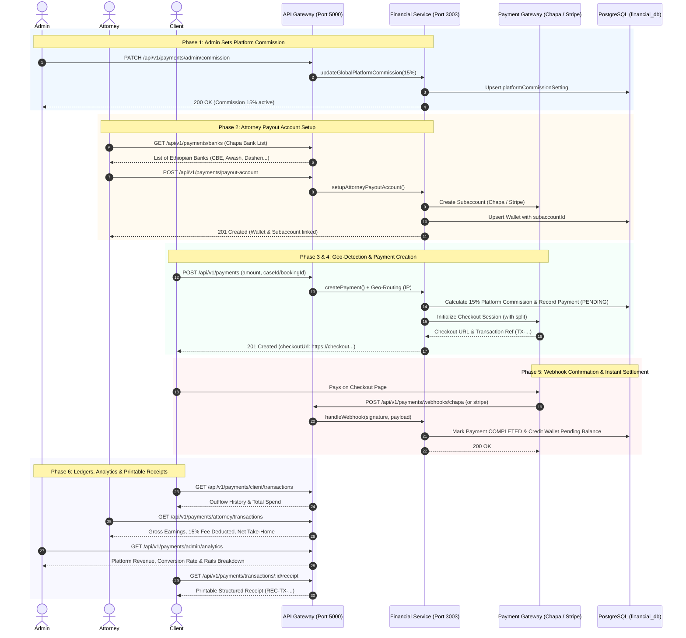

# Tebeka Legal Portal - End-to-End Payment, Commission & Transaction Lifecycle Guide

> **Architecture Overview:**  
> The Tebeka Financial Service orchestrates a **Dual-Rail Payment Architecture**:
> 1. **Domestic Ethiopian Rails (ETB):** Uses **Chapa** (with support for Telebirr, CBE Birr, and Bank of Abyssinia / BOA) with direct subaccount bank split settlement.
> 2. **International Rails (USD / EUR / GBP):** Uses **Stripe Connect** with custom platform fee application and automated destination transfers.
> 3. **Dynamic Geo-Routing:** Automatically detects client IP / Country to route clients to either Ethiopian domestic rails or international Stripe checkout.

---



---

## 1. Phase 1: Admin Sets Platform Commission & Pricing Policies

The platform fee can be set globally (default `15.0%`), or negotiated individually per attorney.

### 1.1 View Global Default Platform Commission
- **Endpoint:** `GET /api/v1/payments/admin/commission`
- **Headers:** `Authorization: Bearer <ADMIN_JWT>`
- **Response:** `200 OK`
```json
{
  "success": true,
  "defaultCommissionPercentage": 15.0
}
```

### 1.2 Update Global Default Platform Commission
- **Endpoint:** `PATCH /api/v1/payments/admin/commission`
- **Headers:** 
  - `Content-Type: application/json`
  - `Authorization: Bearer <ADMIN_JWT>`
- **Request Payload:**
```json
{
  "commissionPercentage": 12.5
}
```
- **Response:** `200 OK`
```json
{
  "success": true,
  "message": "Global platform commission percentage set to 12.5%",
  "setting": {
    "id": "global-platform-setting",
    "defaultCommissionPercentage": 12.5,
    "updatedBy": "admin-user-id",
    "updatedAt": "2026-08-26T12:00:00.000Z"
  }
}
```

### 1.3 Set Custom Commission for a Specific Attorney
- **Endpoint:** `PATCH /api/v1/payments/admin/attorney/:attorneyId/commission`
- **Headers:** `Authorization: Bearer <ADMIN_JWT>`
- **Request Payload:**
```json
{
  "commissionPercentage": 10.0
}
```
- **Response:** `200 OK`
```json
{
  "success": true,
  "message": "Attorney commission percentage updated to 10%",
  "wallet": {
    "id": "wallet-uuid-1",
    "userId": "attorney-uuid-123",
    "availableBalance": 0,
    "pendingBalance": 0,
    "currency": "ETB",
    "splitPercentage": 10.0,
    "updatedAt": "2026-08-26T12:05:00.000Z"
  }
}
```

---

## 2. Phase 2: Attorney Payout Subaccount Setup

Before receiving payouts, the attorney configures their local Ethiopian bank or international Stripe account.

### 2.1 Get Ethiopian Bank List (Direct from Chapa API)
- **Endpoint:** `GET /api/v1/payments/banks`
- **Response:** `200 OK`
```json
{
  "success": true,
  "data": [
    { "id": 1, "name": "Commercial Bank of Ethiopia (CBE)", "code": "cbe" },
    { "id": 2, "name": "Awash International Bank", "code": "awash" },
    { "id": 3, "name": "Dashen Bank", "code": "dashen" },
    { "id": 4, "name": "Bank of Abyssinia", "code": "boa" },
    { "id": 5, "name": "Telebirr Payout", "code": "telebirr" }
  ]
}
```

### 2.2 Setup Ethiopian Chapa Bank Subaccount
- **Endpoint:** `POST /api/v1/payments/payout-account`
- **Headers:** `Authorization: Bearer <ATTORNEY_JWT>`
- **Request Payload:**
```json
{
  "businessName": "Abebe Legal Advisory PLC",
  "accountName": "Abebe Kebede",
  "bankCode": "cbe",
  "bankName": "Commercial Bank of Ethiopia",
  "accountNumber": "1000123456789"
}
```
- **Response:** `201 Created`
```json
{
  "success": true,
  "message": "Payout subaccount successfully registered with Chapa",
  "data": {
    "subaccountId": "sub_attorney-uuid-123_1787735000",
    "bankCode": "cbe",
    "bankName": "Commercial Bank of Ethiopia",
    "accountNumber": "1000123456789",
    "splitPercentage": 15.0
  }
}
```

### 2.3 Setup International Stripe Connect Express Account
- **Endpoint:** `POST /api/v1/payments/stripe/connect-account`
- **Headers:** `Authorization: Bearer <ATTORNEY_JWT>`
- **Request Payload:**
```json
{
  "email": "attorney.diaspora@tebeka.et",
  "businessName": "Tebeka Diaspora Legal Services LLC",
  "country": "US",
  "returnUrl": "https://tebeka.et/attorney/wallet/stripe-success",
  "refreshUrl": "https://tebeka.et/attorney/wallet/stripe-refresh"
}
```
- **Response:** `201 Created`
```json
{
  "success": true,
  "data": {
    "accountId": "acct_dev_attorney-stripe-uuid-1",
    "onboardingUrl": "https://connect.stripe.com/setup/s/dev_acct_dev_attorney-stripe-uuid-1"
  }
}
```

### 2.4 View Attorney Wallet Status
- **Endpoint:** `GET /api/v1/payments/wallet`
- **Headers:** `Authorization: Bearer <ATTORNEY_JWT>`
- **Response:** `200 OK`
```json
{
  "success": true,
  "wallet": {
    "userId": "attorney-uuid-123",
    "availableBalance": 0,
    "pendingBalance": 8500.0,
    "currency": "ETB",
    "splitPercentage": 15.0,
    "chapaSubaccountId": "sub_attorney-uuid-123_1787735000",
    "bankName": "Commercial Bank of Ethiopia",
    "accountNumber": "1000123456789",
    "stripeAccountId": null
  }
}
```

---

## 3. Phase 3: Dynamic Geo-Gateway Resolution

Before checking out, the frontend or backend can detect the appropriate gateway and currency based on the client IP / country.

- **Endpoint:** `GET /api/v1/payments/detect-gateway`
- **Headers:** `X-Forwarded-For: 196.188.1.1` (Ethiopian IP)
- **Response:** `200 OK`
```json
{
  "country": "ET",
  "provider": "CHAPA",
  "currency": "ETB",
  "isDomestic": true,
  "availableProviders": ["CHAPA", "TELEBIRR", "CBE_BIRR", "BOA"]
}
```

*For International Clients (e.g. US IP `8.8.8.8`):*
```json
{
  "country": "US",
  "provider": "STRIPE",
  "currency": "USD",
  "isDomestic": false,
  "availableProviders": ["STRIPE"]
}
```

---

## 4. Phase 4: Payment Creation & Checkout Initialization

### Flow A: Domestic Payment via Chapa (5,000 ETB Case Milestone)
- **Endpoint:** `POST /api/v1/payments`
- **Headers:** `Authorization: Bearer <CLIENT_JWT>`
- **Request Payload:**
```json
{
  "payerId": "client-uuid-456",
  "payeeId": "attorney-uuid-123",
  "caseId": "case-uuid-789",
  "paymentType": "CASE_MILESTONE",
  "milestoneName": "Phase 1: Legal Brief Submission",
  "amount": 5000,
  "currency": "ETB",
  "provider": "CHAPA",
  "description": "Payment for Phase 1 milestone",
  "email": "client.abebe@gmail.com",
  "firstName": "Abebe",
  "lastName": "Kebede",
  "phone": "0911223344",
  "returnUrl": "https://tebeka.et/client/cases/789/payment-success"
}
```
- **Response:** `201 Created`
```json
{
  "success": true,
  "paymentId": "payment-uuid-101",
  "status": "PENDING",
  "amount": 5000,
  "currency": "ETB",
  "commission": 750,
  "provider": "CHAPA",
  "transactionReference": "TX-1787735556160-BKQD8W",
  "checkoutUrl": "https://checkout.chapa.co/checkout/payment/wR5ZOgnwb9y6nUQQgKbnEXkG0kTRhWhWBn3m922QgoPKV"
}
```

---

### Flow B: International Payment via Stripe ($250 USD Consultation)
- **Endpoint:** `POST /api/v1/payments`
- **Headers:** `Authorization: Bearer <CLIENT_JWT>`
- **Request Payload:**
```json
{
  "payerId": "client-diaspora-1",
  "payeeId": "attorney-stripe-uuid-1",
  "bookingId": "booking-uuid-555",
  "paymentType": "CONSULTATION_ONE_TIME",
  "amount": 250,
  "currency": "USD",
  "provider": "STRIPE",
  "description": "Diaspora Legal Consultation Fee",
  "email": "diaspora.client@example.com",
  "returnUrl": "https://tebeka.et/client/consultations/555/payment-success"
}
```
- **Response:** `201 Created`
```json
{
  "success": true,
  "paymentId": "payment-uuid-102",
  "status": "PENDING",
  "amount": 250,
  "currency": "USD",
  "commission": 37.5,
  "provider": "STRIPE",
  "transactionReference": "TX-1787735558687-5ZAHKX",
  "checkoutUrl": "https://checkout.stripe.com/c/pay/cs_test_a1d1bX4nHzIxbjxpKLhpZAXuo3GSNQf6YPY..."
}
```

---

### Flow C: Attorney Requests Payment -> Client Approves
1. **Attorney Requests Payment Milestone:**
   - **Endpoint:** `POST /api/v1/payments/request`
   - **Request Payload:**
   ```json
   {
     "caseId": "case-uuid-789",
     "payerId": "client-uuid-456",
     "amount": 3500,
     "currency": "ETB",
     "milestoneName": "Phase 2: Court Hearing Appearance",
     "description": "Milestone requested upon hearing completion"
   }
   ```
   - **Response:** `201 Created` (`status: "PENDING_APPROVAL"`)

2. **Client Approves & Initiates Gateway Payment:**
   - **Endpoint:** `POST /api/v1/payments/approve`
   - **Request Payload:**
   ```json
   {
     "paymentId": "payment-uuid-103"
   }
   ```
   - **Response:** `200 OK` (Returns `checkoutUrl` and `transactionReference`)

---

## 5. Phase 5: Webhook Processing & Settlement

When the user completes payment on the Chapa or Stripe checkout page, the gateway notifies Tebeka webhooks.

### 5.1 Chapa Webhook Confirmation
- **Endpoint:** `POST /api/v1/payments/webhooks/chapa`
- **Headers:** `x-chapa-signature: <SHA256_HASH>`
- **Payload:**
```json
{
  "tx_ref": "TX-1787735556160-BKQD8W",
  "status": "success",
  "amount": 5000,
  "currency": "ETB",
  "email": "client.abebe@gmail.com",
  "payment_method": "telebirr"
}
```
- **Webhook Action:**
  - Validates HMAC signature.
  - Updates `Payment` record status from `PENDING` -> `COMPLETED`.
  - Sets `paidAt = new Date()`.
  - Credits Attorney `Wallet` pending balance (+4,250 ETB).
  - Inserts double-entry records in `LedgerEntry` (Gross Credit, Platform Commission Fee Debit, Net Balance Credit).
- **Response:** `200 OK`
```json
{
  "status": "success",
  "message": "Payment reference marked as COMPLETED"
}
```

### 5.2 Stripe Webhook Confirmation
- **Endpoint:** `POST /api/v1/payments/webhooks/stripe`
- **Headers:** `stripe-signature: <STRIPE_SIGNATURE_HEADER>`
- **Payload:**
```json
{
  "id": "evt_test_123",
  "type": "checkout.session.completed",
  "data": {
    "object": {
      "id": "cs_test_a1...",
      "client_reference_id": "TX-1787735558687-5ZAHKX",
      "amount_total": 25000,
      "currency": "usd",
      "payment_status": "paid"
    }
  }
}
```
- **Response:** `200 OK`
```json
{
  "status": "success",
  "message": "Payment reference marked as COMPLETED"
}
```

---

## 6. Phase 6: Role-Based Transaction Queries & Analytics

### 6.1 Client Outflow History & Total Spend
- **Endpoint:** `GET /api/v1/payments/client/transactions?page=1&limit=10`
- **Headers:** `Authorization: Bearer <CLIENT_JWT>`
- **Response:** `200 OK`
```json
{
  "success": true,
  "role": "CLIENT",
  "summary": {
    "totalTransactions": 2,
    "spent": {
      "ETB": { "totalSpent": 5000, "successfulCount": 1 },
      "USD": { "totalSpent": 250, "successfulCount": 1 }
    }
  },
  "pagination": { "total": 2, "page": 1, "limit": 10, "totalPages": 1 },
  "data": [
    {
      "id": "payment-uuid-101",
      "transactionReference": "TX-1787735556160-BKQD8W",
      "amount": 5000,
      "currency": "ETB",
      "status": "COMPLETED",
      "paymentType": "CASE_MILESTONE",
      "milestoneName": "Phase 1: Legal Brief Submission",
      "provider": "CHAPA",
      "paidAt": "2026-08-26T12:12:38.000Z"
    }
  ]
}
```

### 6.2 Attorney Earnings Ledger & Net Take-Home
- **Endpoint:** `GET /api/v1/payments/attorney/transactions?page=1&limit=10`
- **Headers:** `Authorization: Bearer <ATTORNEY_JWT>`
- **Response:** `200 OK`
```json
{
  "success": true,
  "role": "ATTORNEY",
  "summary": {
    "totalTransactions": 1,
    "earnings": {
      "ETB": {
        "gross": 5000,
        "commissionDeducted": 750,
        "netEarned": 4250,
        "successfulCount": 1
      }
    }
  },
  "wallet": {
    "availableBalance": 0,
    "pendingBalance": 4250,
    "currency": "ETB"
  },
  "data": [
    {
      "id": "payment-uuid-101",
      "transactionReference": "TX-1787735556160-BKQD8W",
      "amount": 5000,
      "commission": 750,
      "netAmount": 4250,
      "currency": "ETB",
      "status": "COMPLETED",
      "milestoneName": "Phase 1: Legal Brief Submission"
    }
  ]
}
```

### 6.3 Admin Overall Platform Transactions
- **Endpoint:** `GET /api/v1/payments/admin/transactions`
- **Headers:** `Authorization: Bearer <ADMIN_JWT>`
- **Response:** `200 OK`
```json
{
  "success": true,
  "role": "ADMIN",
  "summary": {
    "totalTransactions": 2,
    "volume": {
      "ETB": { "gross": 5000, "platformCommission": 750, "count": 1 },
      "USD": { "gross": 250, "platformCommission": 37.5, "count": 1 }
    }
  },
  "pagination": { "total": 2, "page": 1, "limit": 20, "totalPages": 1 },
  "data": [
    {
      "id": "payment-uuid-101",
      "transactionReference": "TX-1787735556160-BKQD8W",
      "payerId": "client-uuid-456",
      "payeeId": "attorney-uuid-123",
      "amount": 5000,
      "commission": 750,
      "currency": "ETB",
      "provider": "CHAPA",
      "status": "COMPLETED"
    }
  ]
}
```

### 6.4 Admin Financial Analytics
- **Endpoint:** `GET /api/v1/payments/admin/analytics?period=30d`
- **Headers:** `Authorization: Bearer <ADMIN_JWT>`
- **Response:** `200 OK`
```json
{
  "success": true,
  "period": "30d",
  "kpis": {
    "revenue": {
      "ETB": { "grossVolume": 5000, "platformCommission": 750, "netDisbursed": 4250 },
      "USD": { "grossVolume": 250, "platformCommission": 37.5, "netDisbursed": 212.5 }
    },
    "transactions": {
      "total": 2,
      "completed": 2,
      "failed": 0,
      "refunded": 0,
      "successRatePercentage": 100.0
    },
    "activity": {
      "uniqueClientsCount": 2,
      "activeAttorneysCount": 2
    }
  },
  "rails": {
    "CHAPA": { "count": 1, "grossETB": 5000 },
    "STRIPE": { "count": 1, "grossUSD": 250 }
  }
}
```

---

## 7. Phase 7: Printable Itemized Receipt

- **Endpoint:** `GET /api/v1/payments/transactions/:id/receipt`
- **Headers:** `Authorization: Bearer <JWT>`
- **Response:** `200 OK`
```json
{
  "success": true,
  "receipt": {
    "receiptNumber": "REC-TX-1787735556160-BKQD8W",
    "issuedAt": "2026-08-26T12:12:38.000Z",
    "transactionReference": "TX-1787735556160-BKQD8W",
    "paymentType": "CASE_MILESTONE",
    "status": "COMPLETED",
    "merchant": {
      "name": "Tebeka Legal Services Platform",
      "supportEmail": "support@tebeka.et",
      "website": "https://tebeka.et"
    },
    "payer": {
      "id": "client-uuid-456",
      "role": "CLIENT"
    },
    "payee": {
      "id": "attorney-uuid-123",
      "role": "ATTORNEY"
    },
    "item": {
      "title": "Phase 1: Legal Brief Submission",
      "description": "Payment for Phase 1 milestone",
      "caseId": "case-uuid-789"
    },
    "pricing": {
      "grossAmount": 5000,
      "commissionRate": "15%",
      "commissionFee": 750,
      "netPayeeAmount": 4250,
      "currency": "ETB"
    },
    "paymentDetails": {
      "provider": "CHAPA",
      "channel": "telebirr"
    }
  }
}
```

---

## 8. Summary of Endpoints Reference Table

| Category | HTTP Method | Endpoint Path | Description | Access Role |
| :--- | :--- | :--- | :--- | :--- |
| **Admin Pricing** | `GET` | `/api/v1/payments/admin/commission` | Get global platform fee % | Admin |
| **Admin Pricing** | `PATCH` | `/api/v1/payments/admin/commission` | Update global platform fee % | Admin |
| **Admin Pricing** | `PATCH` | `/api/v1/payments/admin/attorney/:id/commission` | Set specific attorney commission | Admin |
| **Attorney Payout** | `GET` | `/api/v1/payments/banks` | Fetch Ethiopian bank codes | Attorney, Public |
| **Attorney Payout** | `POST` | `/api/v1/payments/payout-account` | Setup Chapa bank subaccount | Attorney |
| **Attorney Payout** | `POST` | `/api/v1/payments/stripe/connect-account` | Setup Stripe Connect account | Attorney |
| **Attorney Payout** | `GET` | `/api/v1/payments/wallet` | Check balance & subaccount status | Attorney |
| **Geo-Detection** | `GET` | `/api/v1/payments/detect-gateway` | Detect local vs international rail | All / Public |
| **Payment Flow** | `POST` | `/api/v1/payments` | Direct checkout creation | Client |
| **Payment Flow** | `POST` | `/api/v1/payments/request` | Request milestone payment | Attorney |
| **Payment Flow** | `POST` | `/api/v1/payments/approve` | Approve milestone payment | Client |
| **Webhooks** | `POST` | `/api/v1/payments/webhooks/chapa` | Chapa webhook callback | Chapa Gateway |
| **Webhooks** | `POST` | `/api/v1/payments/webhooks/stripe` | Stripe webhook callback | Stripe Gateway |
| **Ledger & History** | `GET` | `/api/v1/payments/client/transactions` | Client payment outflows | Client |
| **Ledger & History** | `GET` | `/api/v1/payments/attorney/transactions` | Attorney earnings & take-home | Attorney |
| **Ledger & History** | `GET` | `/api/v1/payments/admin/transactions` | Platform gross volume & fees | Admin |
| **Analytics** | `GET` | `/api/v1/payments/admin/analytics` | Revenue KPIs & conversion rate | Admin |
| **Receipts** | `GET` | `/api/v1/payments/transactions/:id/receipt` | Printable itemized invoice | Client, Attorney, Admin |
