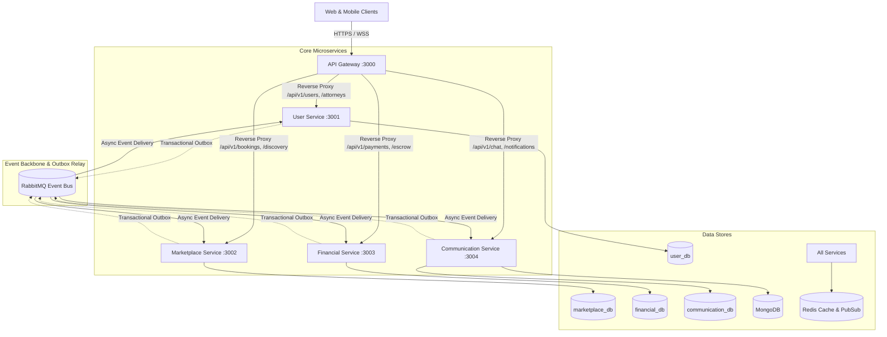
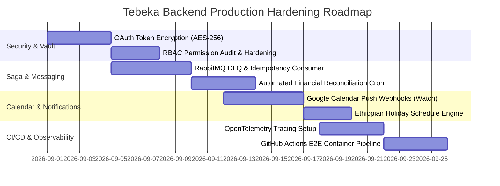

# Tebeka Legal Portal Backend — Architecture Analysis & Developer Challenges

## Executive Summary

The **Tebeka Legal Portal Backend** is designed as a distributed, multi-tenant, event-driven microservices platform servicing the Ethiopian and Diaspora legal technology ecosystem. The system is partitioned into 5 core services (**API Gateway**, **User Service**, **Marketplace Service**, **Financial Service**, and **Communication Service**), backed by PostgreSQL (per-service databases), Redis (caching & rate-limiting), RabbitMQ (event messaging), and MongoDB (unstructured case documents/chat logs).

This document provides an engineering analysis of the system architecture, critical development challenges, architectural gaps, and actionable mitigation roadmaps.

---

## 1. Architectural Overview & Service Boundaries

---

## 2. Key Technical & Developer Challenges (On the Dev Side)

### 🔴 Challenge 1: Multi-Prisma Multi-Schema Management & Windows File Locking
* **The Challenge**: Each microservice maintains its own independent Prisma schema and client output path (`@prisma/client/user`, `@prisma/client/marketplace`, `@prisma/client/financial`, `@prisma/client/communication`).
* **Dev Impact**:
  * On Windows systems, running `prisma generate` while microservices or `node start-all.js` are running triggers `EPERM` file locking errors on `query_engine-windows.dll.node`.
  * TypeScript type-checking across monorepo packages requires manual sub-path configuration in `package.json` and `tsconfig.json`.
* **Mitigation**:
  * Implement automated generation scripts that build to distinct internal build targets or run inside Linux Docker containers.
  * Use workspace aliases (`@workspace/db-user`, `@workspace/db-marketplace`) rather than patching `node_modules/@prisma/client`.

---

### 🔴 Challenge 2: Cross-Service Distributed Sagas & Eventual Consistency
* **The Challenge**: Because each microservice owns its private PostgreSQL database, there are **no foreign key constraints** across services (e.g., `clientId`, `attorneyId`, and `caseId` in Financial/Marketplace are unconstrained UUID strings).
* **The Workflow Clash**:
  1. Client creates a booking in `marketplace-service` (status: `REQUESTED`).
  2. Attorney accepts booking (status: `ACCEPTED_PENDING_PAYMENT`).
  3. Client pays on `financial-service` via Chapa (ETB) or Stripe (USD).
  4. Chapa webhook triggers payment success -> publishes `PAYMENT_SUCCEEDED`.
  5. `marketplace-service` must consume the event to transition booking to `CONFIRMED` and generate Google Meet room.
  6. `communication-service` must dispatch SMS, email, and in-app notifications.
* **Dev Impact**:
  * If the network drops or consumer crashes between steps 4 and 5, money is deducted, but the appointment remains unconfirmed.
* **Mitigation**:
  * Enforce an explicit **Saga Orchestrator** with compensating transactions (refund / status revert) and Dead-Letter Exchanges (DLX) in RabbitMQ.
  * Implement automated background reconciler crons that query unconfirmed paid bookings and auto-heal discrepancies.

---

### 🔴 Challenge 3: Local Dev Environment Complexity & Memory Footprint
* **The Challenge**: Running the full backend locally requires **5 NestJS servers + 4 PostgreSQL databases + Redis + RabbitMQ + MongoDB + Cloudflare Tunnel**.
* **Dev Impact**:
  * Developer machines must allocate 4–8 GB of RAM solely for dev runtime instances.
  * Setting breakpoints and debugging individual service lifecycles within `start-all.js` can be cumbersome compared to dedicated single-service debug runners.
* **Mitigation**:
  * Provide lightweight Docker Compose profiles (`docker compose --profile infra up -d`) to run only databases and broker in Docker while running target services directly with hot-reload (`npm run start:dev:marketplace`).

---

### 🔴 Challenge 4: Ethiopian Market & Multi-Currency Specifics
* **The Challenge**:
  * **Dual Financial Provider Split**: Chapa (Ethiopian Birr - Telebirr, CBE Birr, local banks) vs. Stripe (Diaspora USD/EUR).
  * **Withholding & Commission Calculations**: Splitting escrow funds into 90% attorney payout and 10% platform fee, while withholding mandatory Ethiopian tax percentages.
  * **Timezone & Calendar Peculiarities**: The platform operates in `Africa/Addis_Ababa` (UTC+3) with working days, while Ethiopian courts and legal deadlines observe Ethiopian national and religious holidays.
* **Mitigation**:
  * Centralize date/time calculations with UTC stored in database and localized Addis Ababa representations formatted at the API edge.
  * Build an Ethiopian holiday calendar table in `user-service` to prevent scheduling on national court holidays.

---

## 3. What Was Missed / Gaps to Address Before Production

| # | Gap Area | Description | Severity | Recommended Solution |
| :--- | :--- | :--- | :--- | :--- |
| **1** | **Outbox Relay Daemon** | `OutboxEvent` records are inserted inside database transactions across services, but relying solely on polling workers can introduce latency or duplicate deliveries. | **HIGH** | Implement Debezium CDC (Change Data Capture) or a hardened Redis Streams relay with idempotent message IDs (`idempotencyKey`). |
| **2** | **Centralized Distributed Tracing** | Requests carry `x-correlation-id` in logs, but visual tracing across Gateway ➔ Marketplace ➔ Financial ➔ RabbitMQ is absent. | **MEDIUM** | Integrate OpenTelemetry (OTel) with Jaeger / Grafana Tempo in `@workspace/logger`. |
| **3** | **OAuth Token Encryption at Rest** | `googleRefreshToken` and `googleEmail` are stored in plaintext in `AttorneyProfile`. | **HIGH** | Use AES-256-GCM symmetric encryption via a master key (`DATABASE_ENCRYPTION_KEY`) before saving OAuth tokens. |
| **4** | **Google Calendar Push Webhooks (Reverse Sync)** | The system currently queries Google Free/Busy on-demand. If an attorney adds a court event on Google Calendar, the portal discovers it only during slot queries. | **MEDIUM** | Implement Google Calendar Watch Webhook (`calendar.events.watch`) to receive real-time push notifications of schedule changes. |
| **5** | **Automated Dead Letter Queue (DLQ) Reprocessing** | Failed RabbitMQ consumer messages risk being discarded or blocked in retry loops. | **HIGH** | Add a DLQ retry strategy with exponential backoff and an Admin API dashboard to replay failed saga events. |
| **6** | **E2E Integration Test Suite in CI/CD** | Unit tests exist, but an end-to-end GitHub Actions pipeline spinning up ephemeral Postgres + Redis + RabbitMQ containers is needed. | **HIGH** | Add GitHub Actions workflow `.github/workflows/e2e-tests.yml` utilizing Docker service containers. |

---

## 4. Architectural Strengths of Current Implementation

1. **Clean Microservice Decoupling**: Services are bounded by domain responsibilities (`auth`/`user`, `discovery`/`booking`, `payment`/`escrow`, `chat`/`notifications`).
2. **Resilient Circuit Breaker & Retry Patterns**: Injected into third-party integrations (Google Meet, Chapa, Stripe) via `@workspace/common`.
3. **Double-Booking & Race Condition Protection**: Database-level interactive transactions and real-time Free/Busy subtraction prevent overlapping consultation slots.
4. **Production-Ready Webhook Raw Body Signature Verification**: Stripe HMAC-SHA256 and Chapa secret hash checking operate on raw preserved buffers.

---

## 5. Next Steps & Recommended Milestones

